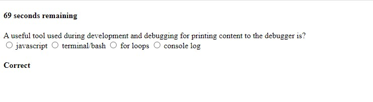
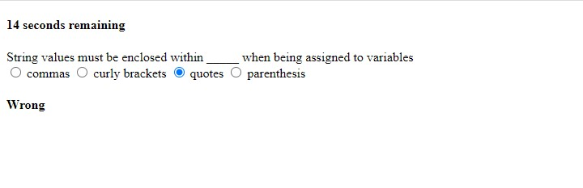

# code_quiz

Sample screenshot of the from the code quiz challenge:

REPOSITORY TITLE: lafry5/code_quiz
    
    Generated code from scratch to create a quiz regarding javascript.

Repository Link: https://github.com/lafry5/code_quiz

Github Page: https://lafry5.github.io/code_quiz/. 

TABLE OF CONTENTS:
    
    -  Clone
 
    -  Setup
 
    -  Contributing

    -  Description
 
    -  Support

Clone:
    Clone this repo to your local machine using https://lafry5.github.io/code_quiz/.
    

Setup:
    Ensure that all files are located in the root folder (Index, Readme file, script and and style).

Contributing:
    Starter code was not provided for this project.

Description:
    This code will generate questions during the quiz regarding javascript. Inputs will be provided by the user regarding their answer choice (a, b, c or d). If the that can be provided are the password length and whether the user would like special characters, upper and lower case, as well as numbers included in their password.  

    Example screenshots are as follows:

 
Support:
    Reach out to me at one of the following places for questions!

    Email: lafry5@yahoo.com 
    Cell: (602) 363-0253
     